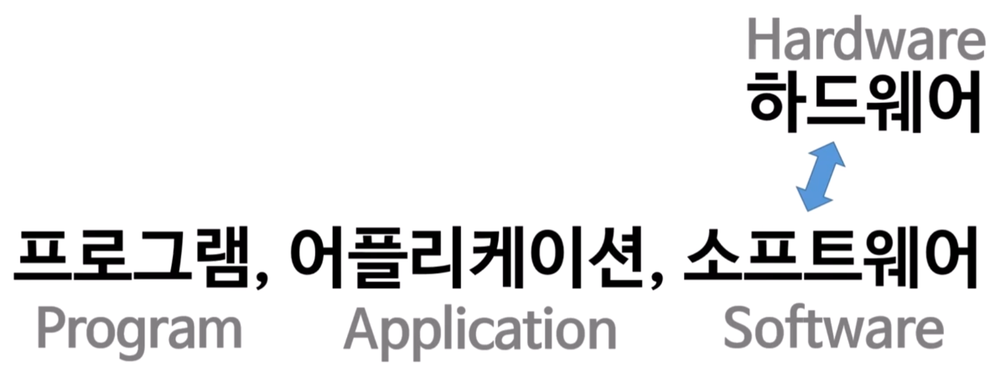
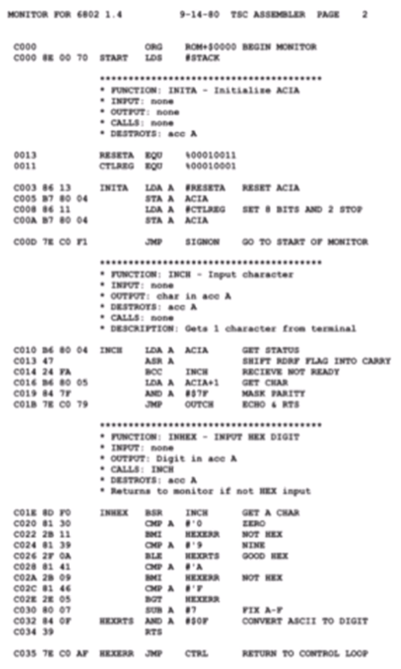
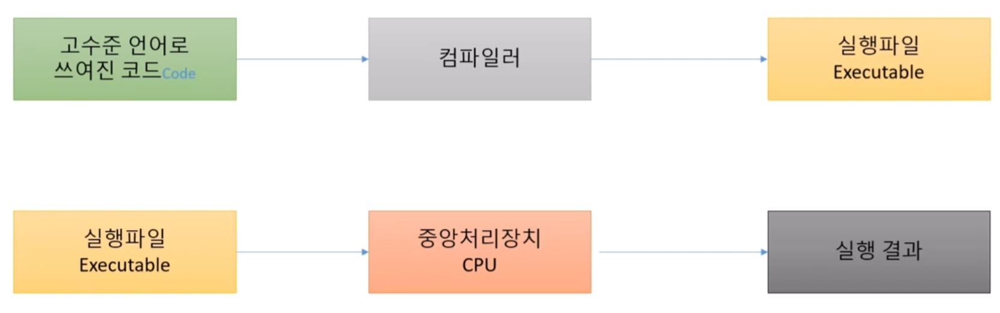
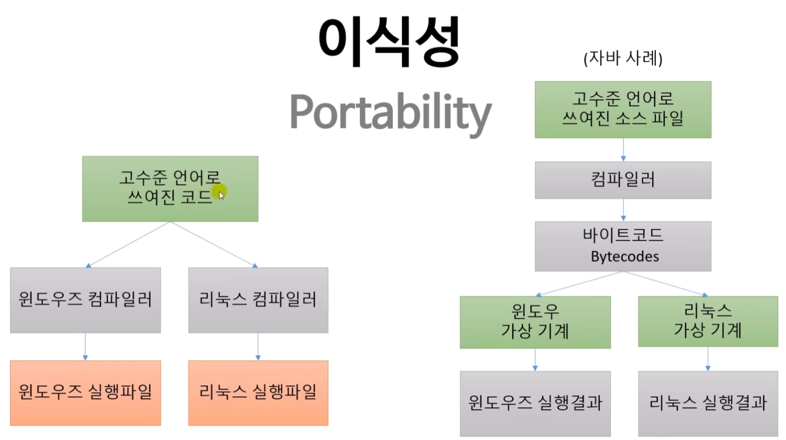

# 0.1 프로그래밍 언어?



## 기계어 (Machine Language)

- 10110000 01100001 (이진)

## 어셈블리 언어 (Assembly Language)



- 저수준 언어
- 주로 CPU가 하는 단위 기능들을 직접 수행

## 고수준 언어 (High-Level Languages)

- 사람에게 가까운 언어
- C, C++, Pascal, Java, Javascript, Perl, Python, ...
    - C, C++ 중간 레벨 언어라고 표현하는 경우도 있음

## 컴파일러 (Compiler)



- 고수준 언어로 쓰여진 코드 -> 컴파일러 -> 실행파일 (Executable)
- 실행파일 -> 중앙처리장치(CPU) -> 실행 결과
- 특징
    - 한 번에 전체 번역: 소스 코드 전체를 기계어로 변환 후 실행 파일 생성
    - 실행 속도 빠름: 이미 기계어로 변환되어 있어 CPU가 바로 실행
    - 오류 검출: 컴파일 시점에 전체 코드의 문법 오류를 미리 발견
    - 배포 용이: 실행 파일만 배포하면 됨 (소스 코드 불필요)
    - **플랫폼 의존적: Windows용, Linux용 등 각각 컴파일 필요**

```
소스 코드 (C, C++, Jave 등)
    ↓ [컴파일]
실행 파일 (.exe, .out 등)
    ↓ [실행]
CPU가 직접 실행
    ↓
결과 출력
```

## 인터프리터 (Interprerter)


- 실행파일이 생성되지 않는다.
- 고수준 언어로 쓰여진 스크립트 -> 인터프리터 -> 중앙처리장치(CPU) -> 실행 결과

```
소스 코드 (Python, JavaScript 등)
    ↓
인터프리터가 한 줄씩 읽음
    ↓
즉시 기계어로 변환하여 CPU 실행
    ↓
결과 출력
```

- 특징
    - 한 줄씩 실행: 코드를 읽으면서 즉시 해석하고 실행
    - 실행 파일 없음: 매번 소스 코드를 해석하며 실행
    - 실행 속도 느림: 실행할 때마다 번역 과정이 필요
    - 즉시 테스트 가능: 코드 수정 후 바로 실행 가능 (컴파일 불필요)
    - 플랫폼 독립적: 인터프리터만 있으면 어디서든 실행
    - 오류 검출: 실행 중에 해당 라인에 도달해야 오류 발견

## 이식성 (Portability)


