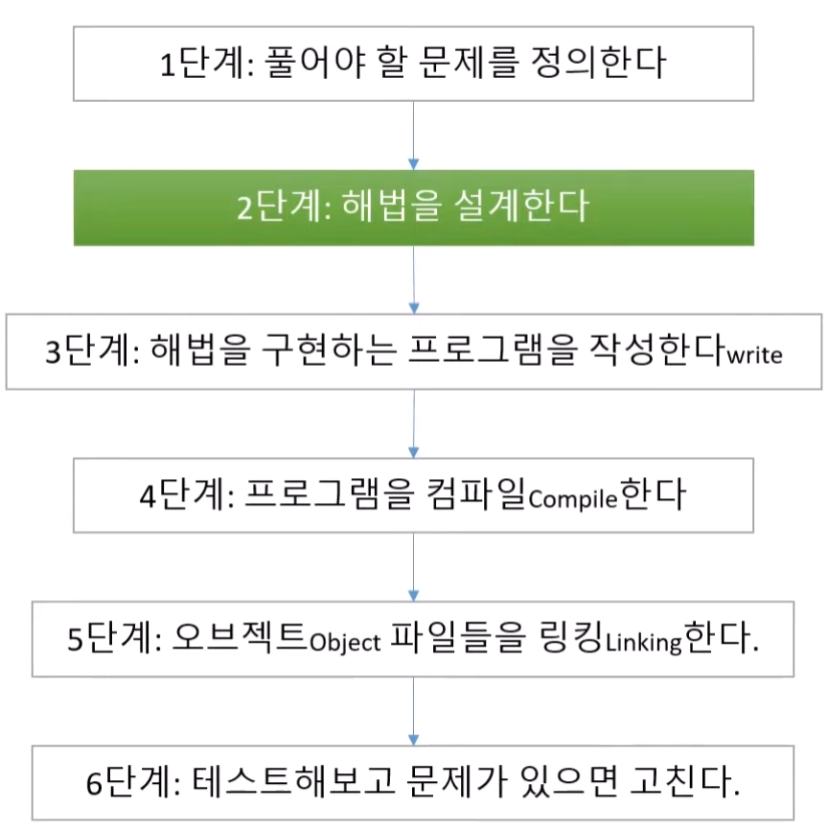
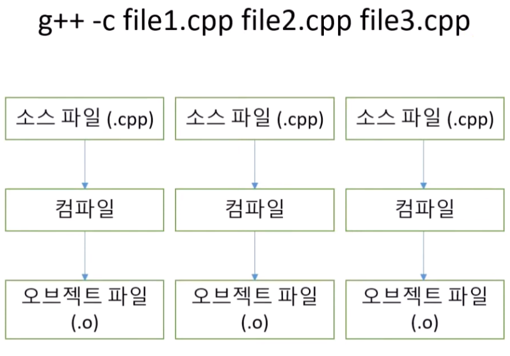
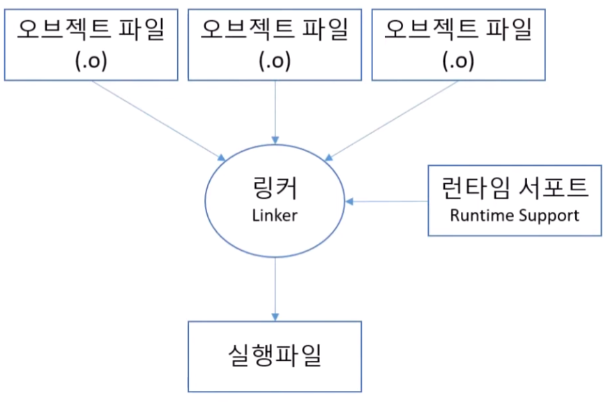

# 0.3 프로그래밍 과정 소개

## 4단계: 프로그램을 컴파일(Compile)

> `g++ -c file1.cpp file2.cpp file3.cpp`

- g++ 컴파일러
- 오브젝트 파일을 따로따로 만든다.

## 5단계: 오브젝트(Object) 파일들을 링킹(Linking)

- 런타임 서포트
    - 컴퓨터에게 일을 시킬 때 모든 일을 전부 다 소스코드에서 짤 필요 없이 다른 프로그래머가 짠 코드를 가져다가 사용하면 된다
    - 실행 중에 프로그램을 지원하는 기반 시스템
